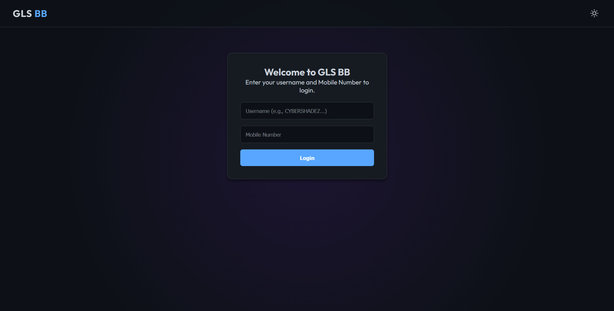
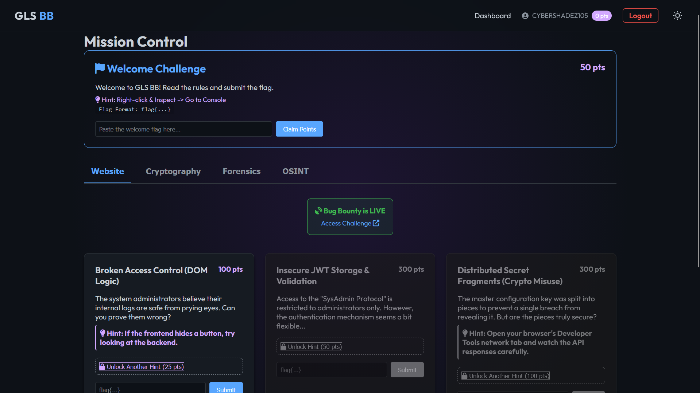
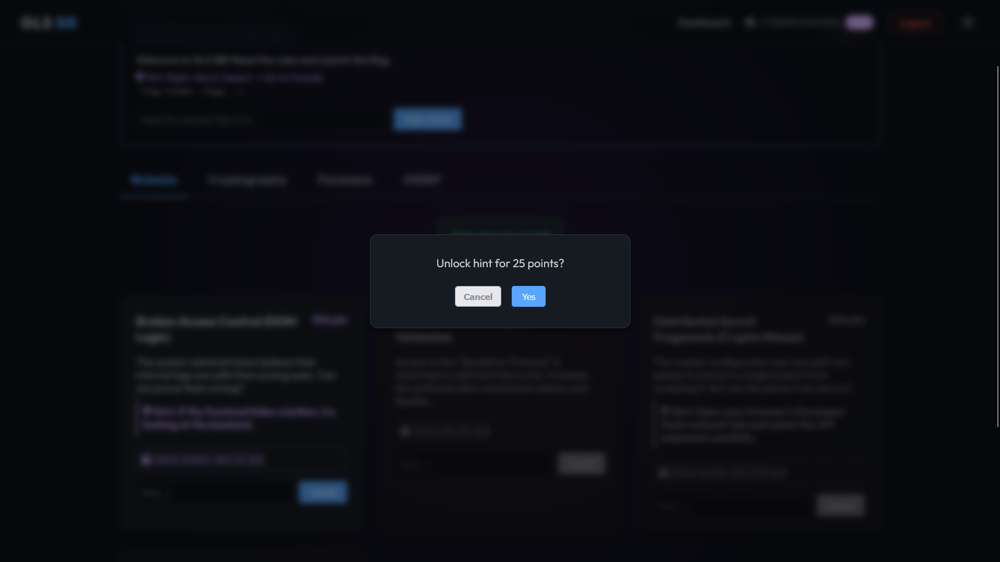
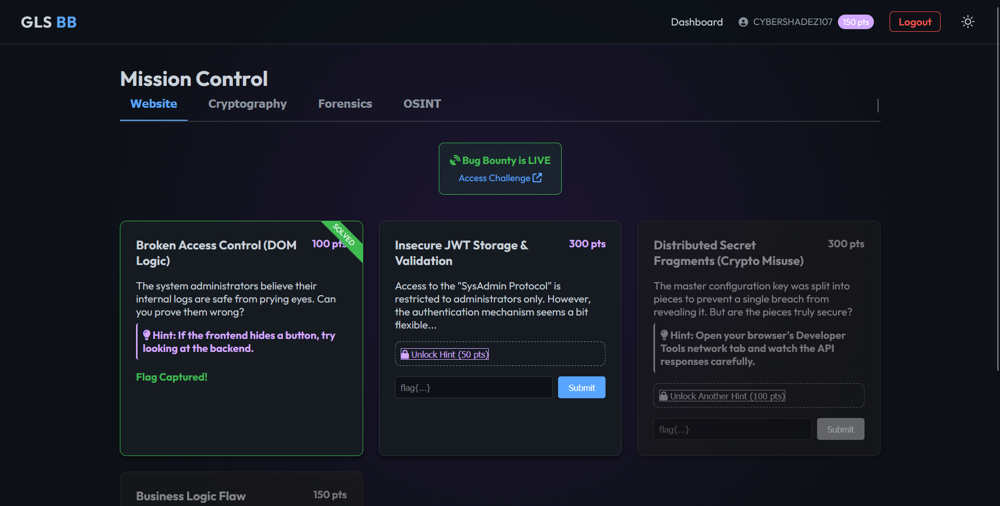
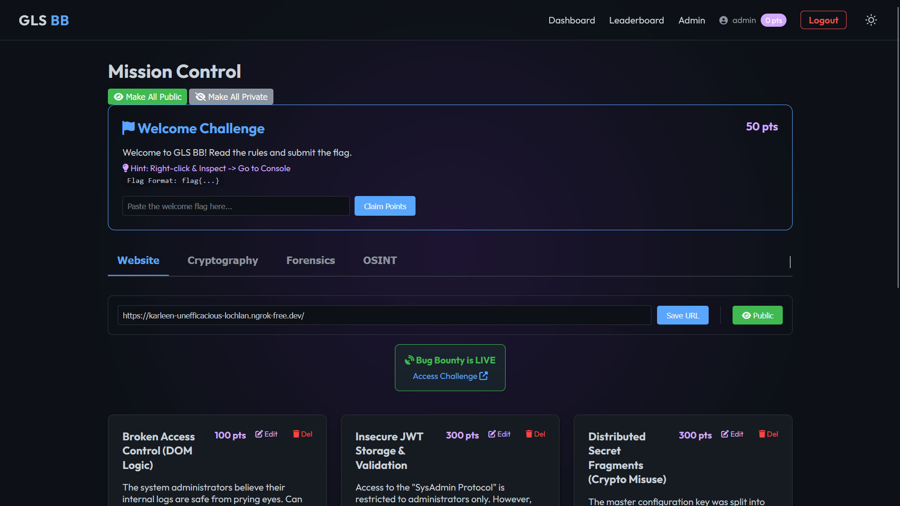
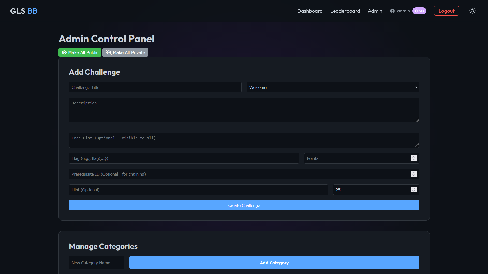
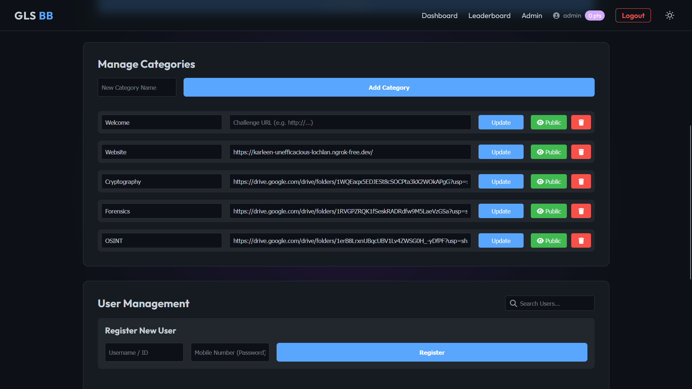
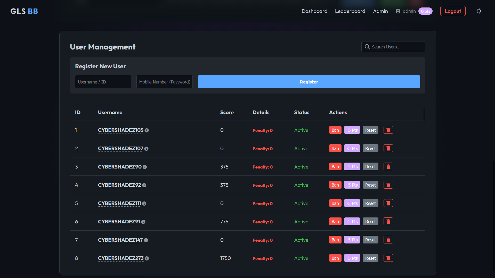
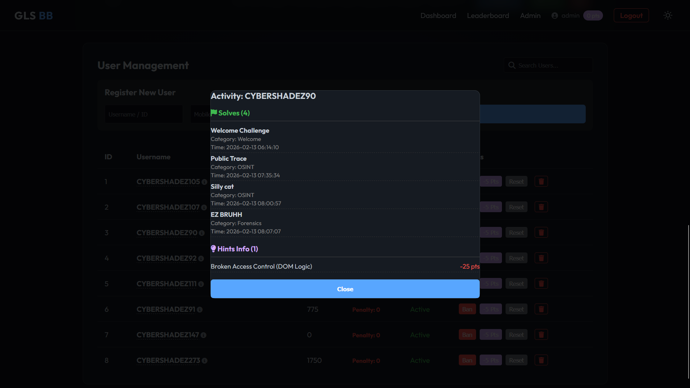
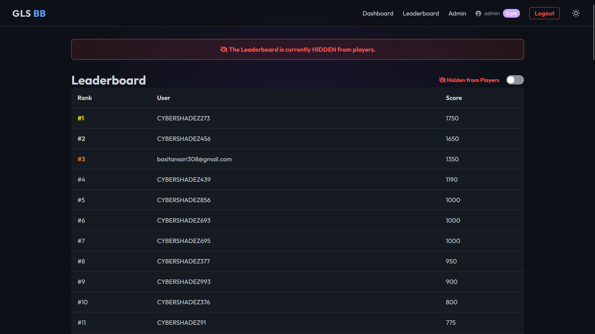

# GLS Bug Bounty Platform

<p align="center">
  
  
  
  
  
  
  
</p>

## Overview
The GLS Bug Bounty Platform is a secure, enterprise-grade Capture-The-Flag (CTF) environment designed for hosting internal security challenges, hackathons, and training events. Built on a lightweight Flask (Python) architecture with SQLite, it offers high performance and ease of deployment. 

**LIVE Demo:** [bit.ly/glsBB](https://bit.ly/glsBB)  
*(Currently deployed and hosted on **Oracle Cloud Free Tier**)*

## Demo & Screenshots

**Watch the full walkthrough on YouTube:**

**[Watch the walkthrough on YouTube](https://youtu.be/jxuVYR-oZ_4)**

<details>
<summary><b>View Screenshots (Click to Expand)</b></summary>

### Participant Experience





### Administration & Control Panel







</details>

## Key Features

### Participant Interface
*   **Challenge Dashboard**: Centralized view for filtering challenges by category and difficulty.
*   **Flag Verification**: Real-time validation engine for flag submissions to provide instant feedback.
*   **Hint System**: Automated hint delivery with configurable point deductions.
*   **Live Leaderboard**: Real-time ranking system tracking user progress and scores dynamically.
*   **Progression Logic**: Prerequisite system to unlock advanced challenges upon completion of foundational tasks.

### Administration & Control
*   **Admin Console**: Comprehensive, authenticated dashboard (`/admin`) for full platform management.
*   **User Management**:
    *   Full user registry view.
    *   Ban/Unban functionality for strict rule enforcement during events.
    *   Server-side password reset capabilities.
*   **Challenge Management**:
    *   Full CRUD (Create, Read, Update, Delete) operations for challenges.
    *   Detailed configuration of points, flags, hint costs, and category assignments.
*   **Visibility Control**:
    *   Global "Go Live" toggle for immediate event launch and synchronization.
    *   Granular visibility settings per category to stage challenge releases.
*   **Reporting**: Data export functionality to track metrics, post-event analysis, and auditing.

## Technology Stack

*   **Backend Framework**: Python 3.x, Flask (Lightweight, extensible)
*   **Database**: SQLite (Optimized with Write-Ahead Logging (WAL) for high concurrency)
*   **ORM**: SQLAlchemy (Secure database interactions preventing SQL injection)
*   **Frontend**: HTML5, CSS3, Vanilla JavaScript (Fast, responsive, no bloated dependencies)
*   **Web Server**: Gunicorn (WSGI) behind Nginx (Reverse Proxy)
*   **Operating System**: Ubuntu Linux (Oracle Cloud / AWS compatible)

## Cloud Deployment

The platform is architected for deployment on Oracle Cloud Infrastructure (Always Free Tier), utilizing Ampere A1 or AMD Micro instances.

### Quick Start Guide

1.  **Provisioning**: Deploy an Ubuntu 20.04/22.04 instance.
2.  **Networking**: Configure Virtual Cloud Network (VCN) with a Public Subnet.
3.  **Security**: Configure Oracle Security List to allow Ingress on Port 80 (TCP).

### Deployment Commands

```bash
# 1. Access Server
ssh -i key.key ubuntu@<YOUR_IP>

# 2. Install Dependencies
sudo apt update
sudo apt install python3-pip python3-venv nginx -y

# 3. Deploy Application
# (Transfer deploy.zip via SCP)
unzip deploy.zip
cd bb_platform
python3 -m venv venv
source venv/bin/activate
pip install -r requirements.txt

# 4. Start Services
sudo systemctl start bb_platform
sudo systemctl restart nginx
```

For detailed, step-by-step instructions including screenshots, security configurations, and troubleshooting, please refer to **[DEPLOYMENT.md](DEPLOYMENT.md)**.

## Administration Guide

### Access
Navigate to `/login` and authenticate with administrative credentials to access the `/admin` dashboard.

### Database Management
*   **Initialization**: The database is automatically initialized on the first application run.
*   **Reset**: Execute `python scripts/reset_db.py` to purge all data and re-initialize the schema.
*   **Migrations**: Schema changes typically require migration scripts. See `add_category_public_column.py` for examples of stateless schema updates.

### Password Recovery
Administrative passwords can be reset directly via the server console if access is lost:

```bash
cd ~/bb_platform
source venv/bin/activate
python3
>>> from app import app, db, User
>>> with app.app_context():
...     u = User.query.filter_by(username='admin').first()
...     u.password = 'NEW_STRONG_PASSWORD'
...     db.session.commit()
```

## Project Structure

*   `app.py`: Core application logic and routing.
*   `models.py`: Database schema definitions (SQLAlchemy).
*   `config.py`: Application configuration and environment variables.
*   `requirements.txt`: Python dependency manifest.
*   `run_prod.py`: WSGI entry point for production servers using Waitress.
*   `static/`: Static assets (CSS styles, Vanilla JS scripts, Images).
*   `templates/`: HTML templates rendered via Jinja2.
*   `instance/`: Database storage directory (`ctf.db`).
*   `DEPLOYMENT.md`: Comprehensive cloud deployment documentation.
*   `scripts/make_zip.py`: Build script to bundle the application for deployment.

## License

This project is licensed under the GNU General Public License v3.0 (GPL-3.0). See the [LICENSE](LICENSE) file for details.

## Original Author

**Dhiptanshu Malik**

Creator & Lead Developer

- GitHub: https://github.com/Dhiptanshu
- LinkedIn: https://www.linkedin.com/in/dhiptanshu

## Project Continuation

This project was originally developed for GLS University as an educational Capture-The-Flag (CTF) and Bug Bounty Platform.

Future students and contributors are encouraged to improve, extend, and maintain the platform under the terms of the GNU GPL v3 License.

Please preserve the original copyright notice, license, and Git history whenever possible.

© 2026 Dhiptanshu Malik
